# **ELEMENTOS DE NAVEGACIÓN**
Identifica los elementos de navegación en los siguientes sites:
## ** I - BREATHER**

1.Navegación Global 

2.Navegacion Local
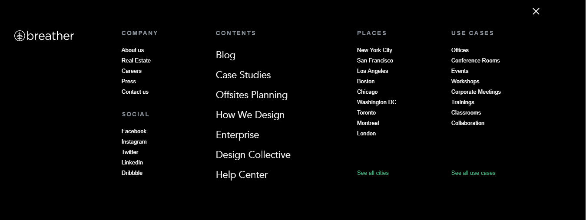

3.Navegacion Facetada
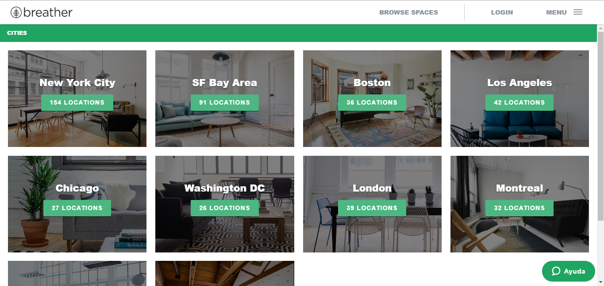

4.Navegacion Filtrada
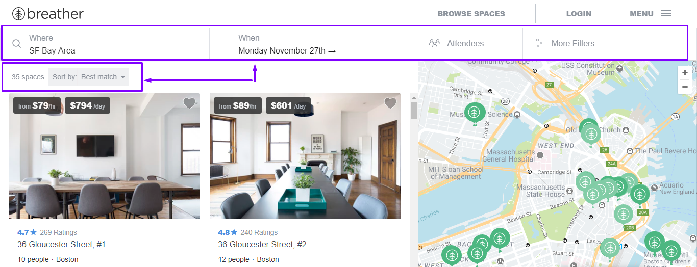
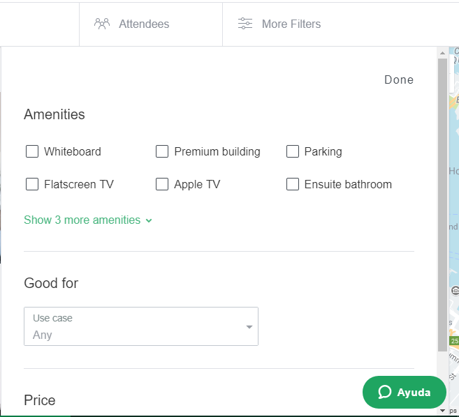

5.Navegacion Contextual
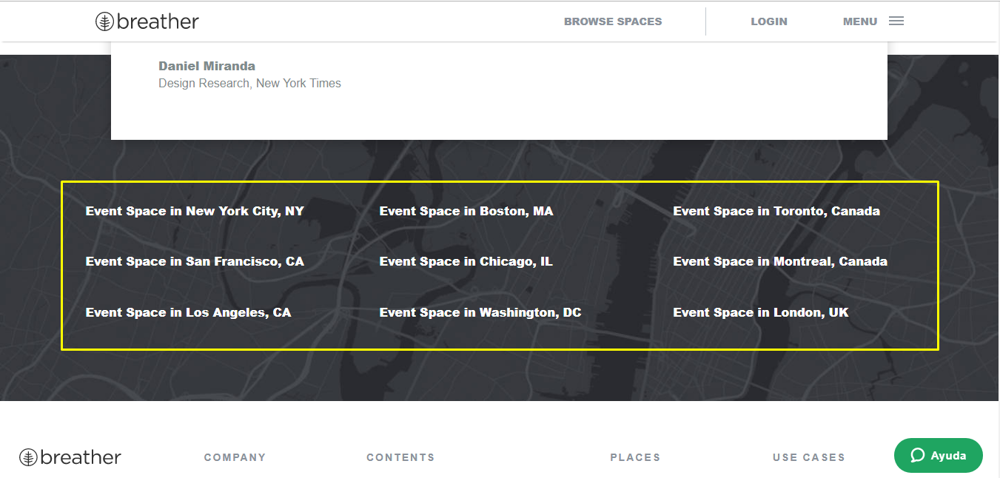

6.Navegacion En linea
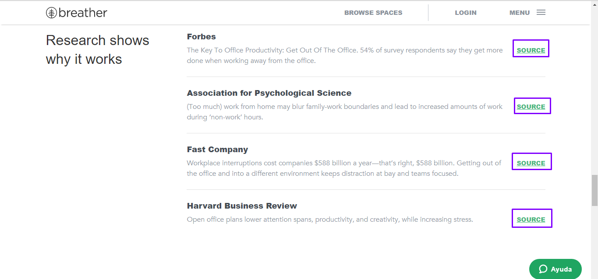

7.Navegacion Suplementaria
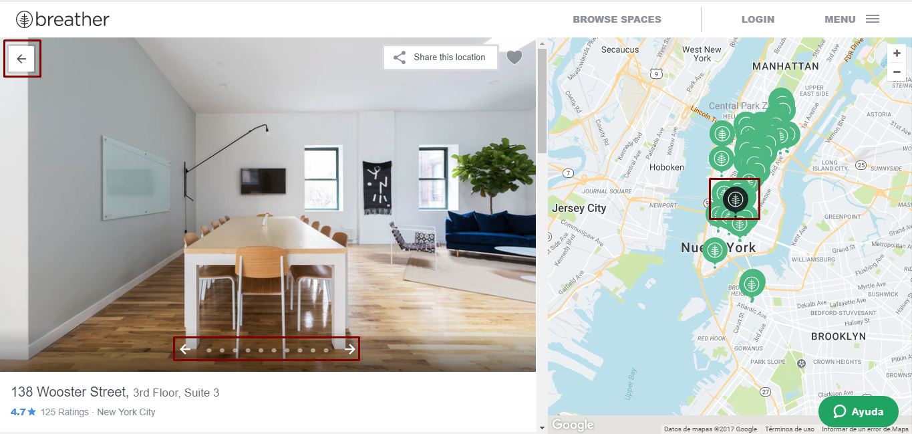

## ** II - GITHUB**

1.Navegación Global 

2.Navegacion Local
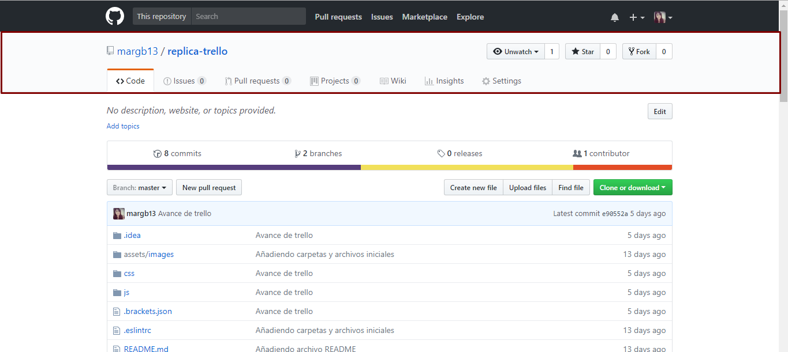

3.Navegacion Facetada
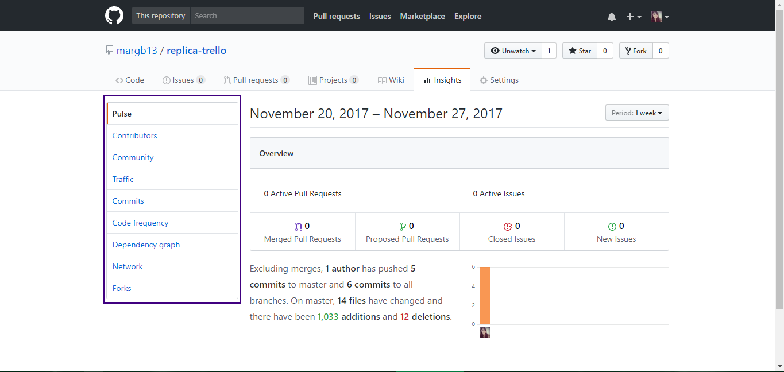
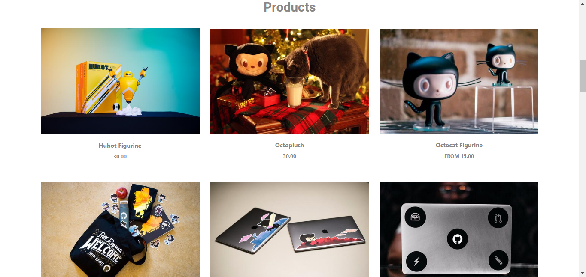

4.Navegacion Filtrada
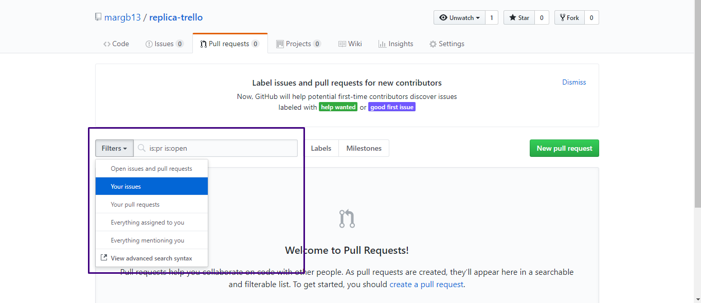
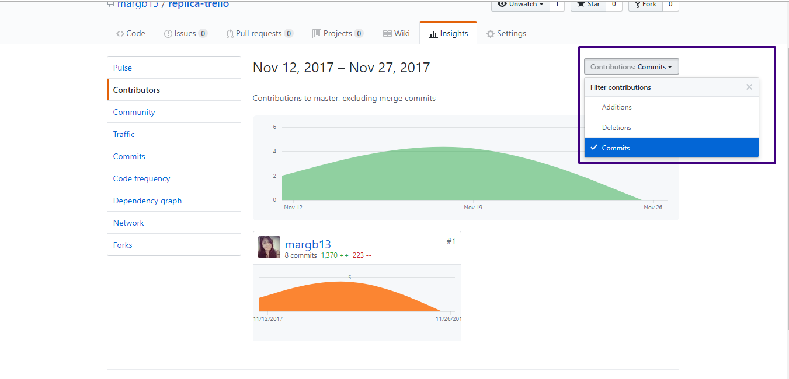

5.Navegacion Contextual
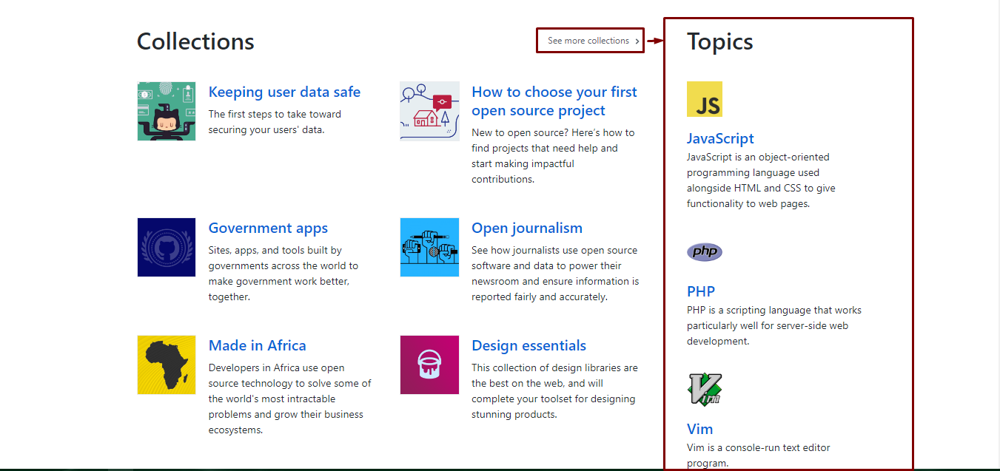

6.Navegacion En linea
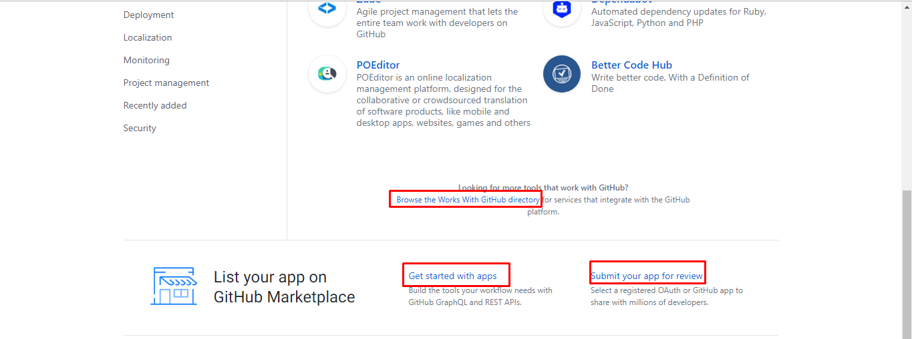

## ** III - MEDIUM**

1.Navegación Global 

2.Navegacion Local
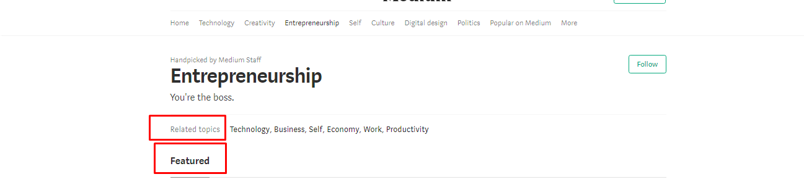

3.Navegacion Facetada
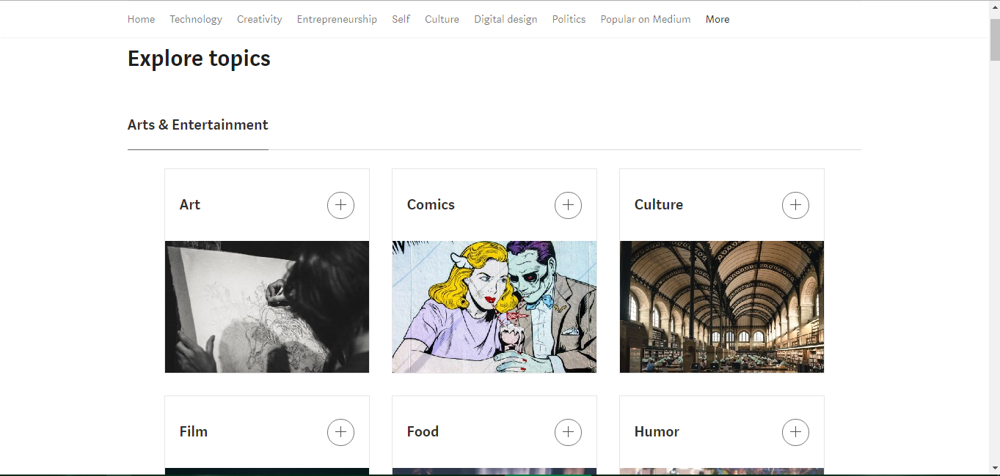

4.Navegacion Contextual
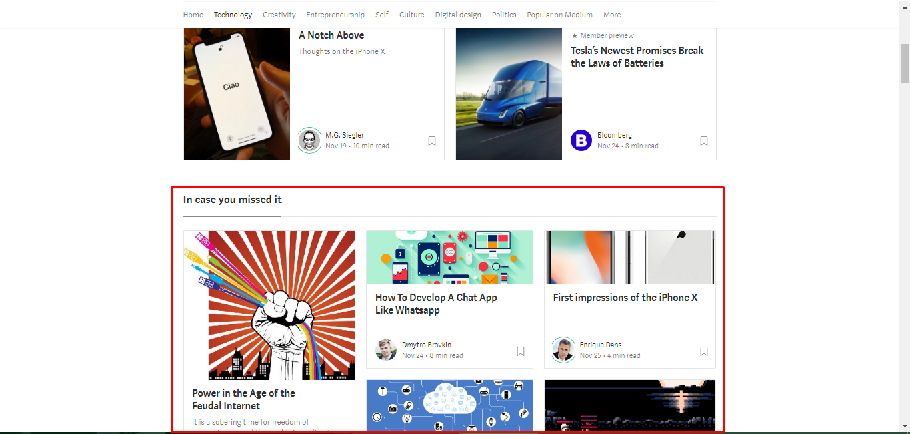

5.Navegacion En linea
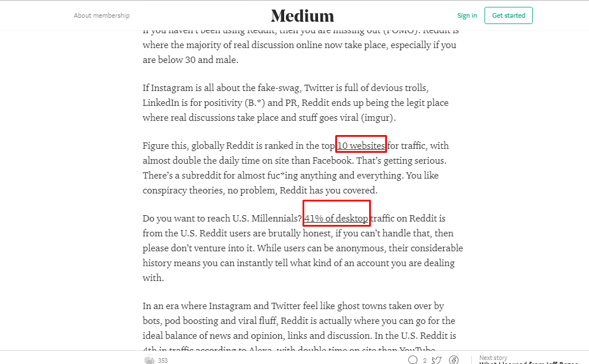

6.Navegacion Suplementaria
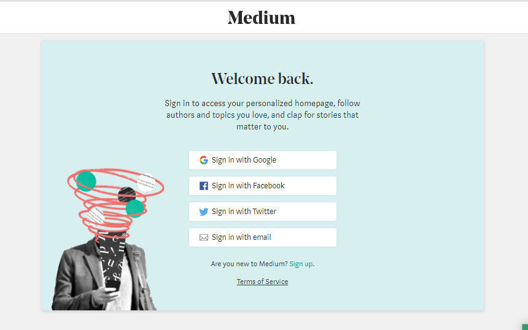
